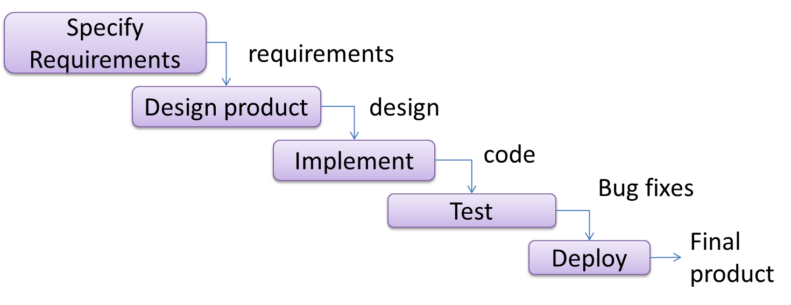
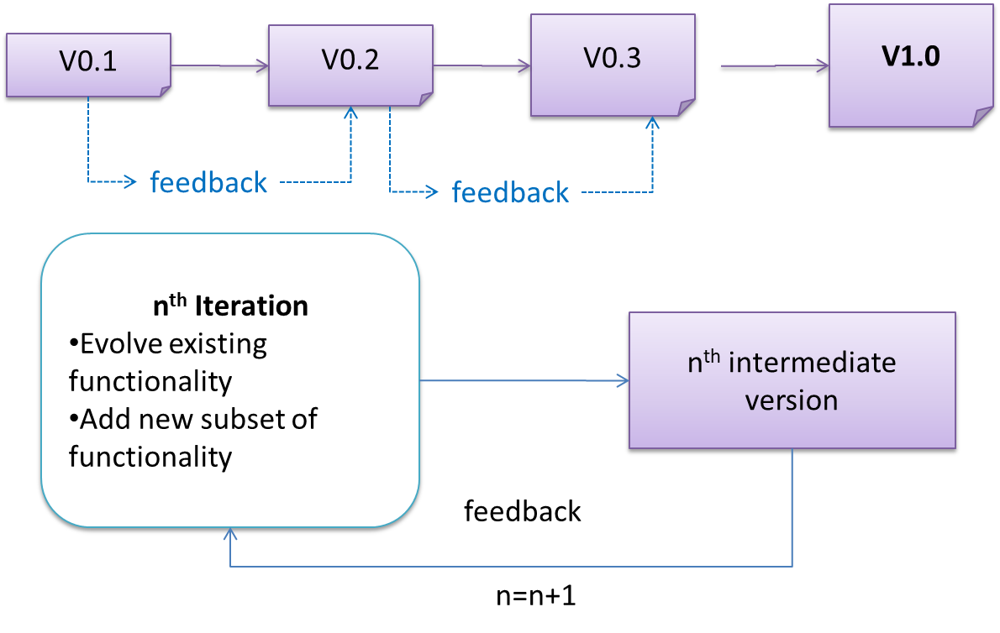

# Orbital'25 Summer Cohort 🚀

Briefing
by Lee Zong Xun

---

## Who am I?

  

  I recently graduated NUS, studying computer science and statistics.

- CVWO, Expensify, Jupyterlab, TikTok, QRT.
- ex-VP of NUS DG, ex-Chair of SoC TIPS.
- Full time offers at Meta, QRT, TikTok etc.
- Currently in Hong Kong 😁
  

  Feel free to connect with me! 
  Github: @Zxun2  \\ LinkedIn: Lee Zong Xun

---

## What about you? 🤩

---

## Software Development Lifecycle (SDLC)

Software development goes through **different stages** such as requirements, analysis, design, implementation and testing. These stages are collectively known as the software development life cycle (SDLC).

---

### Sequential Models

Also called the waterfall model, models software development as a linear process.
- When one stage of the process is completed, it should produce some artifacts to be used in the next stage.
- Useful if problem statement is well-understood and stable. 
- Real-world project are rarely well-understood. 🥲 

---

#### Waterfall

---

### Iterative

The iterative model (sometimes called iterative and incremental) advocates having several iterations of SDLC.

- **breadth-first**: an iteration evolves all major components in parallel.
- **depth-first**: an iteration focuses on fleshing out only some components.

---

---

### Agile

Popular Agile Methodologies:

- Scrum (https://www.mountaingoatsoftware.com/agile/scrum/meetings/daily-scrum)
- XP programming (http://www.extremeprogramming.org/)

---

### Demo (real quick) 🐌

---

## Level of Achievements 🏆

---

### Gemini

Gemini projects are not meant to be complex but it can’t be just bare-bones.

---

**Features**

- 3~5 feature of sufficient complexity in total
- Use of database (workload must be justified otherwise there is no database)

**Planning / Version Control (via Git + GitHub)**

- GitHub repo + Basic version control (e.g., add / commit / push / pull)

**Design**

- Use cases and features
- Flow and architecture

---

**Implementation**

- Organization of files into folders
- Code level comments

**Testing**

- System testing by the developers

**Documentation**

- Proper description of the system in project README, project poster and project video

---

**Quality of peer evaluation given**

- Average feedback rating >= 3

**Teamwork**

- Proper contributions to the project (esp. in terms of coding) from both members of the team.

---

### Apollo

Apollo teams need to showcase good evidence of SE and are expected to complete more work of higher quality within the same timeline.

---

**Features**

- 6~8 feature of sufficient complexity in total
- Use of database (workload must be justified otherwise there is no database)

**Planning / Version Control (via Git + GitHub)**

- GitHub repo + Basic version control (e.g., add / commit / push / pull)
- Github issues with (monthly) milestones / labels / tags / assignee + Intermediate version control (branching, pull request)

---

**Design**

- Use cases and features
- Flow and architecture
- Design diagrams (drawn with tools): Sequence diagram, activity diagram, class diagram, ER diagram, etc.
- Design principles + pattern
- Design decisions (alternatives, criteria, comparison and justification)

---

**Implementation**

- Organization of files into folders
- Code level comments
- Coding Standard
  
**Testing**

- System testing by the developers
- Multi-level (unit / integration / system) testing with automation + User testing
- Proper test strategy (planning / test case design)

---

**Documentation**

- Proper description of the system in project README, project poster and project video
- SE evidence in every stage of the development process in project README, project poster and project video
- 30+ pages of README

**Quality of peer evaluation given**

- Average feedback rating >= 4

**Teamwork**

- Proper contributions to the project (esp. in terms of coding).

---

### Artermis

Artemis level is meant to be exclusive (top 5~10%) for projects that are complex and with strong evidence of SE, and expected to complete more work of higher quality roughly one Milestone ahead (e.g., completion of technical proof-of-concept within Liftoff).

---

**Features**

- 9+ feature of sufficient complexity in total
- Use of database (workload must be justified otherwise there is no database)

**Planning / Version Control (via Git + GitHub)**

- GitHub repo + Basic version control (e.g., add / commit / push / pull)
- Github issues with (monthly) milestones / labels / tags / assignee + - Intermediate version control (branching, pull request)
- 2-week sprint with objectives / allocation / tracking.
- Github Projects + Code Review + CI/CD

---

**Design**

- Use cases and features
- Flow and architecture
- Design diagrams (drawn with tools): Sequence diagram, activity diagram, class diagram, ER diagram, etc.
- Design principles + pattern
- Design decisions (alternatives, criteria, comparison and justification)

---

**Implementation**

- Organization of files into folders
- Code level comments
- Code Review

**Testing**

- System testing by the developers
- Multi-level (unit / integration / system) testing with automation + User testing
- Proper test strategy (planning / test case design)

---

**Documentation**

- Proper description of the system in project README, project poster and project video
- SE evidence in every stage of the development process in project README, project poster and project video
- 50+ pages of README

**Quality of peer evaluation given**

- Average feedback rating >= 4

**Teamwork**

- Proper contributions to the project (esp. in terms of coding) .

---

## Lift Off Requirements

- An A4-size poster named as <Team ID>.jpg/.png (e.g., 1999.jpg).
- A ~1-minute presentation video named as <Team ID>.mp4 (e.g., 1999.mp4).
- The links should be Google Drive File Links and publicly accessible.

--- 

### Lift Off Example 1 (with permission)

- Poster: https://drive.google.com/file/d/1GhANGcJOWDSWxmkzQ4ik3wGv1tcEAzPt/view
- Video: https://drive.google.com/file/d/1Uexjeg6JUD68PN-voyypULNUqZb7U8Ly/view

---

### Lift Off Example 2 (with permission)

- Poster: https://drive.google.com/file/d/1td9zN11_imdD6b44G9agxm87ELuMs0Uj/view?usp=sharing
- Video: https://youtu.be/ccki3p1nzdo?list=PLLSECIsYjSIwLRWCruGapCHftSrGAPhmc

---

## Let's go through your proposal 🌅

Focus on the How's and Why's.
